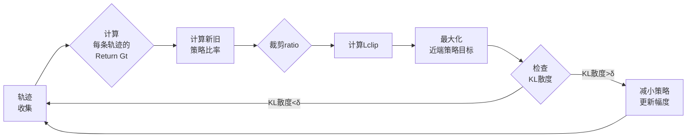

```mermaid
graph LR
A[轨迹\n 收集] -->B{计算\n 每条轨迹的\n Return Gt}
B --> C[计算新旧\n 策略比率] 
C --> D{裁剪ratio}
D --> E[计算Lclip]   
E --> F[最大化\n近端策略目标]
F --> G{检查\n KL散度}
G -->|KL散度<δ| A  
G -->|KL散度>δ| H[减小策略\n更新幅度]
H --> A
```
